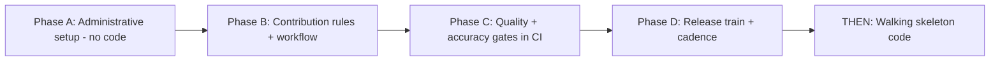
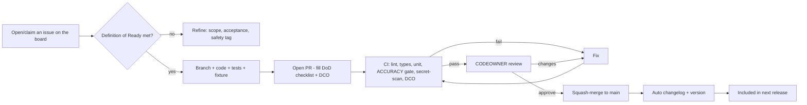
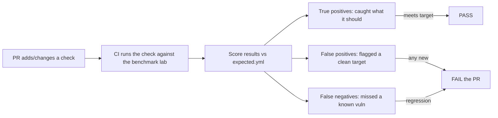

# Provex — Project Management & Governance Playbook

*The administrative foundation to set up **before** writing feature code, done the standard open-source way, so the project meets its targets and any contributor can understand the flow and be held to a quality bar.*

> Working name: **Provex** (swappable). Repo/CLI: `provex`. License: Apache-2.0 (open core). This playbook is Phase A→D of "how we run the project"; the technical plan lives in `ROADMAP.md` and the build blueprint.

---

## 0. The order of operations (do NOT skip ahead)



Everything below Phase A is a one-time setup measured in **days**, not weeks. Get it right once and the project runs itself.

---

## Phase A — Administrative setup (before any feature code)

### A1. Decide identity (½ day)
- [ ] Name locked: **Provex**. Check `.io`/`.dev` domain + a basic trademark search.
- [ ] One-line description: *"Open-source, governed automated security validation — web, API & infra in one console. Safe by default."*
- [ ] Own account vs org: **start with a public repo on your account.** Move to an Org when contributors/enterprise repo arrive.

### A2. Create the repository (½ day)
- [ ] Public repo `provex`, initialized with `README.md`, `.gitignore`, **`LICENSE` = Apache-2.0**.
- [ ] Add GitHub **topics**: `security`, `penetration-testing`, `vulnerability-scanner`, `security-validation`, `devsecops`, `open-source`, `self-hosted`.
- [ ] Turn on: Issues, Discussions, Projects. Turn off Wiki (use `docs/` instead).

### A3. Community health files (1 day) — the standard GitHub set
Create these (GitHub recognizes them and shows them in the contributor UI). Purpose in one line each:

| File | Purpose |
|---|---|
| `README.md` | What it is, quickstart (`docker compose up`), status, links. |
| `LICENSE` | Apache-2.0 (the open core). |
| `CONTRIBUTING.md` | How to contribute, DCO sign-off, adapter cookbook, DoR/DoD. |
| `CODE_OF_CONDUCT.md` | Contributor Covenant (standard, copy-paste). |
| `SECURITY.md` | How to report a vuln in Provex itself (private disclosure). |
| `RESPONSIBLE_USE.md` | Authorized-use-only clause for offensive tooling. |
| `GOVERNANCE.md` | Who decides what, how maintainers are added, how the roadmap changes. |
| `SUPPORT.md` | Where to ask questions (Discussions, not issues). |
| `CHANGELOG.md` | Human-readable release notes (Keep a Changelog format). |
| `CODEOWNERS` | Who must review changes to each area (see A6). |
| `.github/ISSUE_TEMPLATE/*` | Structured bug / feature / new-adapter / detection-issue forms. |
| `.github/PULL_REQUEST_TEMPLATE.md` | The DoD checklist every PR must tick. |
| `.github/workflows/*` | CI: lint, test, accuracy gate, DCO, secret-scan, release. |
| `.github/FUNDING.yml` | Sponsors link (GitHub Sponsors / Open Collective) — set up early. |

### A4. GitHub Projects board (½ day) — this is your project management
Create a **GitHub Project (v2)** named "Provex Roadmap". Add these **custom fields**:
- **Status**: `Backlog → Ready → In progress → In review → Blocked → Done`
- **Area**: `core`, `web`, `api`, `infra-ad`, `ai`, `report`, `platform-sec`, `docs`, `ci`
- **Priority**: `P0-critical`, `P1`, `P2`, `P3`
- **Effort**: `XS/S/M/L/XL`
- **Milestone**: link to A5
- **Type**: `feature`, `bug`, `adapter`, `use-case`, `docs`, `chore`

Create three **views**: a **Board** (by Status), a **Roadmap/timeline** (by Milestone/date), and a **"Good first issues"** filter. This board *is* how you track targets — every issue lives here.

### A5. Milestones (¼ day) — map 1:1 to the roadmap
Create milestones `v0.1 MVP`, `v0.5 Depth`, `v1.0 Full`, `v2.0 Reach`, each with a due date and a one-line exit criterion (from `ROADMAP.md` §6). Every issue gets a milestone or stays in Backlog.

### A6. CODEOWNERS + branch protection (¼ day)
- [ ] `CODEOWNERS`: for now you own everything (`* @you`); as area owners join, assign `backend/modules/web/ @web-owner` etc. so the right person must approve.
- [ ] Protect `main`: require PR, require CI to pass, require 1 approving review, require DCO sign-off, no direct pushes, linear history.

### A6.5. Track `.claude/` as project governance (critical — don't skip)
The Claude Kit installs a `.claude/` folder, and kits often **gitignore it as local config**. For Provx that's wrong: the rules and skills *are* the project's enforced governance and must ship with the repo, or contributors clone a project whose enforced rules aren't actually present.
- [ ] **Track** (governance, shared with everyone): `.claude/rules.md`, `.claude/skills/`, `.claude/scripts/`, `.claude/workflows/`.
- [ ] **Keep local** (per-machine): `.claude/settings.local.json` and any personal/state files.
- [ ] Fix `.gitignore` so the governance files are tracked and only the local ones are ignored; confirm with `git status` that `rules.md`/`skills/`/`scripts/` are staged.
- [ ] Keep `.claude/rules.md` (enforced) and `docs/PROVX_RULES.md` (human-readable safety contract) **in parity** — same rule IDs, no divergence. A drift between them means the doc lies about what's enforced.

**Why it matters:** the "the machine enforces the standard for everyone" model depends entirely on `.claude/` being version-controlled. Untracked = one `git clean`/fresh clone from losing every guardrail, and contributors never receive the rules, skills, or pre-commit hook.

### A7. Labels (¼ day) — standard taxonomy
`type:bug` `type:feature` `type:adapter` `type:use-case` `type:docs` `type:chore` · `area:web` `area:api` `area:infra` `area:ai` `area:report` `area:core` `area:platform-sec` · `priority:P0…P3` · `good-first-issue` · `help-wanted` · **`needs-fixture`** · **`needs-accuracy-review`** · **`safety-review`** · `blocked` · `duplicate` · `wontfix`. (Commit a `labels.yml` so labels are reproducible.)

**End of Phase A = a fully governed empty repo.** No feature code yet, and that's correct.

---

## Phase B — Contribution rules & workflow

### B1. Branching & commits (the standard trunk model)
- **GitHub Flow**: `main` is always releasable; work happens on short-lived branches `type/short-desc` (e.g. `adapter/nuclei-graphql`), merged via PR.
- **Conventional Commits** (`feat:`, `fix:`, `docs:`, `chore:`, `test:`) → enables automated changelog + versioning.
- **Semantic Versioning** (`MAJOR.MINOR.PATCH`). Use `release-please` (or Changesets) to automate version bumps + changelog from commits.
- **DCO sign-off** (`git commit -s`) enforced by a CI check — lightweight, keeps copyright with authors, enough for open core.

### B2. The contribution flow (what every contributor follows)



### B3. Definition of Ready (before work starts)
An issue is "Ready" only if it has: a clear problem statement, acceptance criteria, an **Area** label, a **safety classification** (`passive`/`intrusive`), and — for a detection/adapter — a note on how accuracy will be tested.

### B4. Definition of Done (before merge) — the PR checklist
Straight from the standard (`ROADMAP.md` §2). The PR template forces the author to tick:
- [ ] Safety tag correct; intrusive gated to Active; no state change in passive.
- [ ] Findings de-duplicated; carry severity + CVSS + ≥1 ATT&CK technique.
- [ ] **Fixture test included** (raw tool output → expected findings).
- [ ] **Accuracy gate passes** (no new false positives on clean targets; catches the intended vuln in the lab).
- [ ] Docs/manifest updated.
- [ ] No secrets logged; audit-logged if state-changing.
- [ ] DCO signed.

---

## Phase C — Quality & accuracy gates (how we stop false positives/negatives and bad code)

This is the heart of "we work as a team and keep quality high." A PR cannot merge unless **all** CI gates are green. Six gates:

1. **DCO check** — every commit signed off.
2. **Lint + format** — `ruff`/`black` (Python), `eslint`/`prettier` (frontend). Style is not a debate; the bot decides.
3. **Type check** — `mypy`/`pyright`, `tsc`. Catches whole classes of bad code.
4. **Unit + parser fixtures** — every tool adapter ships a recorded sample of the tool's raw output plus the expected normalized findings. If a wrapped tool changes its output format, this fails in CI instead of silently breaking users.
5. **Accuracy / false-positive gate (the big one)** — see C1.
6. **Secret scanning + dependency audit** — `gitleaks` on the diff, `pip-audit`/`npm audit`, and a license check so no incompatible dependency sneaks in.

### C1. The accuracy harness — how we objectively prevent false positives & false negatives
The `lab/` folder holds a **benchmark**: intentionally-vulnerable targets (positive cases) **and** known-clean targets (negative cases), each with an `expected.yml` manifest listing exactly which findings should and should not appear.



Rules the harness enforces:
- A new check **must** detect its target vuln in the lab (no false negative on the case it claims to cover).
- A new check **must not** raise findings on the clean baselines (zero new false positives).
- A change that **regresses** accuracy on any existing case fails — so quality only goes up.
- Every finding carries a **confidence** level; low-confidence checks are marked and can be filtered, so noise is opt-in.
- **Severity/CVSS must be justified** in the PR and **ATT&CK mapping is required** — reviewed by the area CODEOWNER, not just the bot.

This is how a solo maintainer + many contributors keep signal quality without manually re-testing everything: the machine proves each contribution's accuracy on every PR.

---

## Phase D — Release train & cadence (mapped to your rhythm)

Truthful framing: **daily human feature-pushes solo are not realistic — and you don't need them.** What you *do* get daily is automated activity. Here's the honest mapping to what you described:

| Your wish | What actually happens (sustainable) |
|---|---|
| "Push something every day" | **Automated daily commits**: bots pull new Nuclei templates / CVE-KEV / exploit-DB content and bump tool + dependency versions. Real, visible, daily progress — without you touching it. |
| "One or two features every two months" | **Bi-monthly minor release** (`v0.x`): 1–2 new modules/adapters/use-cases, batched, changelog-driven. This is the human feature cadence. |
| "Updates every ~10 months / yearly" | **Yearly major release** (`vX.0`): big milestone + external security audit of Provex itself + license/governance review + dependency license audit. |
| Weekly hygiene | Triage the board, merge green PRs, cut a patch if security-relevant. |

**Content vs code separation:** detection/exploit content is versioned apart from the app, so staying current is a *data pull*, not a release — you inherit the community's daily speed instead of racing it. That's the whole trick to "always up to date" as one person.

---

## Ready-to-paste starter templates

### `.github/PULL_REQUEST_TEMPLATE.md`
```markdown
## What & why
<!-- Problem this solves. Link the issue. -->

## Definition of Done
- [ ] Safety: tagged passive/intrusive; intrusive gated to Active; no state change in passive
- [ ] Findings de-duplicated; severity + CVSS set; >=1 MITRE ATT&CK technique mapped
- [ ] Fixture test added (raw tool output -> expected findings)
- [ ] Accuracy gate passes (no new false positives on clean lab targets; catches the target vuln)
- [ ] Docs/manifest updated
- [ ] No secrets logged; state-changing actions audit-logged
- [ ] Commits signed off (DCO, `git commit -s`)

## How I tested
<!-- Lab targets used, results -->
```

### `.github/ISSUE_TEMPLATE/new-adapter.yml` (excerpt)
```yaml
name: New tool adapter / use-case
description: Propose wrapping a tool or adding a detection use-case
labels: ["type:adapter", "needs-fixture", "needs-accuracy-review"]
body:
  - type: input
    attributes: { label: Tool / use-case name }
  - type: dropdown
    attributes: { label: Area, options: [web, api, infra-ad, ai, report] }
  - type: dropdown
    attributes: { label: Safety class, options: [passive, intrusive] }
  - type: textarea
    attributes: { label: How will accuracy be tested? (lab target + expected findings) }
```

### `CODEOWNERS`
```
*                       @you
/backend/modules/web/   @you
/backend/modules/api/   @you
/backend/modules/infra_ad/ @you
/backend/ai/            @you
/docs/                  @you
```

### CI skeleton `.github/workflows/ci.yml` (gate names only)
```yaml
name: ci
on: [pull_request]
jobs:
  dco: { runs-on: ubuntu-latest, steps: [ /* verify Signed-off-by */ ] }
  lint: { runs-on: ubuntu-latest, steps: [ /* ruff, eslint */ ] }
  types: { runs-on: ubuntu-latest, steps: [ /* mypy, tsc */ ] }
  unit-fixtures: { runs-on: ubuntu-latest, steps: [ /* pytest adapters */ ] }
  accuracy: { runs-on: ubuntu-latest, steps: [ /* run checks vs lab, score TP/FP/FN */ ] }
  secrets-deps: { runs-on: ubuntu-latest, steps: [ /* gitleaks, pip-audit, license check */ ] }
```

---

## The "start here" checklist (your first 1–2 weeks, in order)

1. [ ] Lock the name + domain + trademark check (Provex).
2. [ ] Create the public repo with Apache-2.0.
3. [ ] Add all Phase A3 community health files (start from templates above + Contributor Covenant).
4. [ ] Set up the GitHub Project board (fields, 3 views) and the 4 milestones.
5. [ ] Add labels (`labels.yml`), CODEOWNERS, branch protection on `main`.
5b. [ ] Fix `.gitignore` so `.claude/` governance (rules/skills/scripts/workflows) is **tracked**, only local settings ignored (A6.5).
6. [ ] Add the PR template, issue forms, and CI skeleton (gates can start as no-ops, filled in as features land).
7. [ ] Write the first 10 issues on the board: the **walking skeleton** broken into tasks, each `Ready`.
8. [ ] Open a public roadmap so contributors see the standard and where help is wanted.
9. [ ] **Only now** write the walking-skeleton code (ROADMAP §3).

When each item is done, the board reflects it — and the roadmap updates as reality moves. Follow the map, adjust the map, and grow toward the big competitors little by little, free and governed the whole way.
