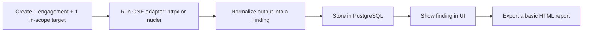
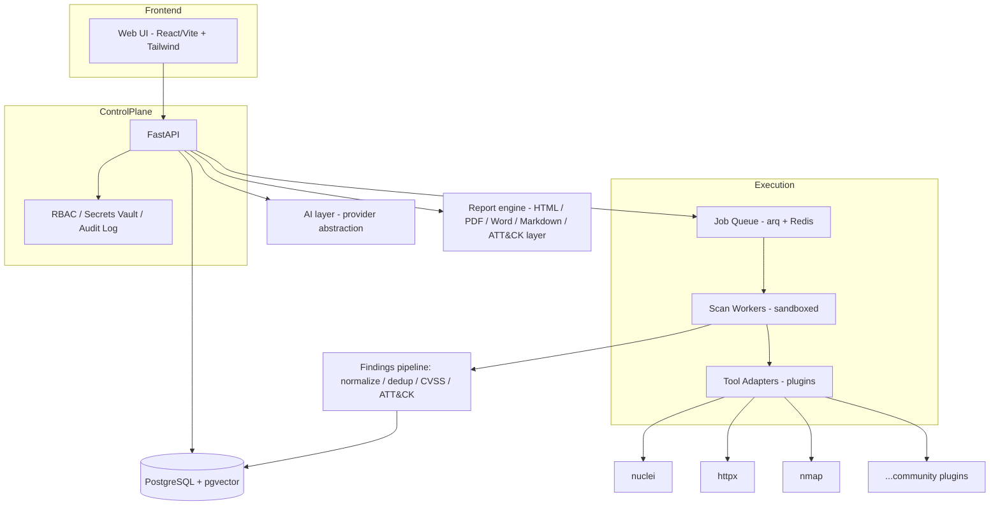
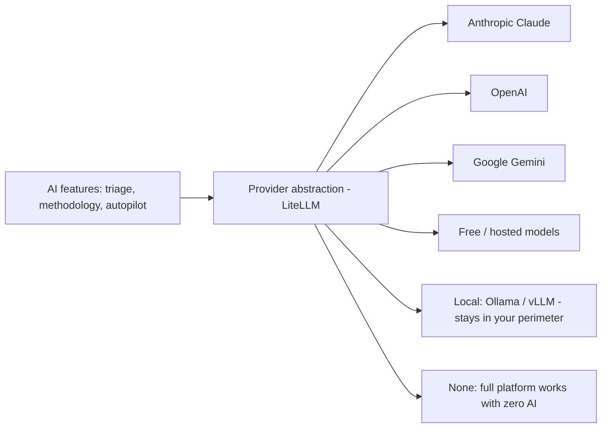
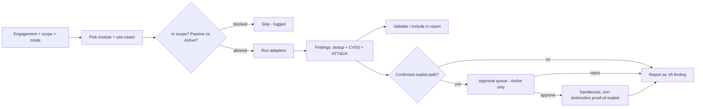
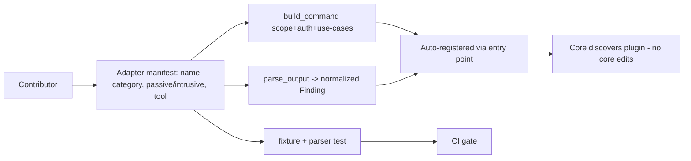
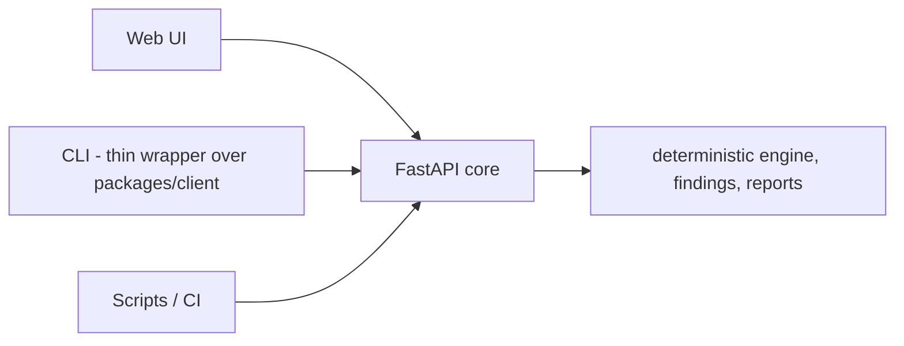
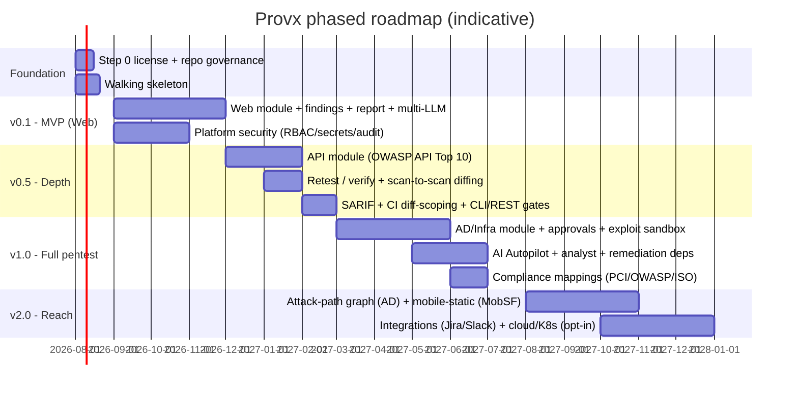

# Provx — Roadmap & Contributor Standard

*The governed, open-source automated security validation platform. Web · API · AD/Infra in one console. Safe enough to run against a test environment without changing anything; exploitation only ever runs on explicit human approval.*

This document is the **standard we hold every contribution to** and the **map of where we're going**. If you're contributing, read the "Definition of Done" and the "Safety Contract" first — a PR that violates them will not be merged no matter how clever it is.

---

## 1. North Star (what "good" means here)

We are **not** trying to out-feature Pentera or NodeZero. Those are 100-person teams. Our wedge is the thing none of the open-source tools and none of the paid tools give away for free:

> **A safe-by-default, governed, pluggable pentest platform that a small team or consultant can run continuously between their paid human pentests — without breaking anything and without being locked to one AI vendor.**

Four principles every feature must serve:

1. **Solve a real problem** — not add a checkbox for attention. If it doesn't help someone find, understand, or fix a real vuln, it doesn't ship.
2. **Safe by default** — passive mode does nothing destructive. Intrusive checks need Active mode; exploitation needs per-finding approval. We advise running against **test environments**, and even then the tool must not change state unless explicitly approved.
3. **Pluggable everything** — tools, use-cases, report templates, and AI providers are all plugins. The core stays small; the ecosystem grows.
4. **AI is optional, never required** — the platform is fully usable with no AI at all. When AI is on, the user picks the provider (cloud, local, or free) and brings their own key.

---

## 2. Definition of Done (every contribution)

A change is "done" only when **all** of these are true. This is the bar contributors sign up to:

- **Safety.** Any new check is tagged `passive` or `intrusive`. Intrusive checks are gated to Active mode and never run in passive/test. No check writes/deletes/modifies target state unless it is an approval-gated exploit.
- **Signal quality.** New findings are de-duplicated, carry a severity + CVSS, and map to at least one MITRE ATT&CK technique. No noisy "info" spam without value.
- **Tested.** Every tool adapter ships with a fixture (sample raw output) + a parser test, so a tool changing its output format is caught by CI, not by users.
- **Documented.** A new use-case/adapter/provider updates its plugin manifest and one line of docs. Undocumented features are considered incomplete.
- **Platform security respected.** No secret is logged. Credentials/tokens/sessions are encrypted at rest. Every state-changing action is written to the audit log.
- **Responsible use.** No feature that only makes sense for unauthorized attacks (e.g. built-in target-less mass exploitation).

---

## 3. Where to start — Step 0 and the Walking Skeleton

### Step 0 — Lock ownership before code (½ day, do this first)
This is the one that bites people later. Decide now, because you cannot retrofit it once outside PRs arrive:

- **License model: Open Core.** Core repo under **Apache-2.0** (permissive + patent grant, corporate-legal-friendly). Keep future paid features (SSO, multi-tenant, hosted SaaS, advanced reporting) in a **separate private repo** — that way community contributions to the core never need to be relicensed, and you keep the money-makers.
- **Contributions: DCO, not a heavy CLA.** A `Signed-off-by` line per commit. Low friction; keeps copyright with authors; enough for open core.
- **Trademark the name "Provx."** The trademark is often what you actually license commercially. Cheap insurance.
- **Ship a `RESPONSIBLE_USE.md` + `SECURITY.md`** from commit #1 (offensive tooling = real liability).

### Step 1 — The Walking Skeleton (the actual first code)
Do **not** build the MVP feature list yet. Build the thinnest possible end-to-end slice that proves the architecture works, then thicken it:

When that one slice works — scope check, adapter, normalized finding, storage, UI, report — everything else is "add more adapters and use-cases." Ship this in week 1–2.

---

## 4. The Base (v0.1 MVP)

The minimum that is genuinely useful and credible. Scope is deliberately narrow.

**In scope for MVP:**
- Engagement management: client, scope (allow/deny), targets, rules of engagement.
- Operating mode: passive/active toggle + the intrusive gate.
- **Web module only**, curated safe use-cases first: `fingerprint`, `tech_detect`, `content_discovery`, `security_headers`, `cors`, `tls`, `misconfig`, plus nuclei-driven CVE/exposure checks. Add intrusive input-validation checks (`sqli`, `xss`, …) behind Active mode.
- Authenticated scanning: form/cookie/bearer/header (basic).
- Findings pipeline: normalize → **dedup** → CVSS → ATT&CK tag → store.
- Findings UI: list, filter, details, validate, "in report" toggle.
- Branded report: HTML + PDF (exec summary, findings, ATT&CK coverage, remediation).
- **Multi-LLM abstraction with AI OFF by default** (analyst = optional triage/summary).
- Platform security: RBAC, encrypted secrets, audit log.
- Plugin contract v0 (tool adapter + use-case interface) — even if only 3 adapters exist.
- One-command bring-up: `docker compose up`.

**Explicitly OUT of MVP (say no in writing so you don't half-build them):** API module, AD/Infra, exploitation runners, cloud/K8s, mobile, scheduling, integrations, attack-path graphs. They come later — see roadmap.

---

## 5. Architecture

### Multi-LLM (and no-AI) — a first-class design goal

Rules: AI is **opt-in**, **bring-your-own-key**, provider-swappable in one setting, and every AI-assisted output is clearly labelled as such. A local model option is mandatory for regulated/air-gapped users — never force traffic to a third-party model.

### Safe scan lifecycle

### Plugin/adapter model (how contributors extend without touching core)

### Interfaces — one API, three front-ends

The CLI is a **first-class interface**, not an afterthought. Web UI, CLI, and scripts are all clients of the same FastAPI core, so they share one code path and never drift.

The CLI is a thin wrapper over [`packages/client`](../packages/client/) (the API client already in the monorepo); UI and CLI reach parity for free because both are just callers. Non-negotiables:

- **Governance parity, not a bypass.** The CLI is an API client, so it inherits every safety gate — scope (PX-SCOPE), passive/active (PX-PASSIVE / PX-ACTIVE), approval-gated exploitation (PX-EXPLOIT). There is no CLI backdoor around the rules.
- **Machine-friendly output:** `--json` and **SARIF** output, plus meaningful **exit codes** (non-zero on failure/policy breach) so it drops into CI pipelines and PR gates.
- **Local or remote:** point at a local instance or a remote server (`--server`) with token auth.
- **Works with zero AI:** deterministic by default; the AI advisor is an opt-in flag.
- **Standalone install** (`pipx install provx`) so people start from the terminal without deploying the full stack.

**Timing:** build a minimal `provx scan` + `provx findings list` over `packages/client` **right after the walking skeleton (§3) exists — not before.** A `packages/cli/` placeholder reserves the structure now; the CLI grows with the API. Both UI and CLI ship free (see the monetization mechanic in §6).

---

## 6. Roadmap (v0.1 → v2.0)

Dates are **solo-dev estimates** and will move — they signal sequence and standard, not promises.

**Milestone gates (a version isn't "done" until):**
- **v0.1** — a stranger can `docker compose up`, scan a lab target authenticated, get a de-duplicated finding list and a branded PDF, with AI off, on a fresh machine, following only the README.
- **v0.5** — API coverage + one-click retest + diff between two scans + a working `POST /scan` API usable in CI.
- **v1.0** — all three modules, approval-gated safe exploitation with replay log, autopilot within scope/mode, compliance-tagged reports. This is the "credible product" line.
- **v2.0** — attack-path graph, mobile static, integrations, optional cloud.

### Rolling additions from the competitor/tool landscape

The staged plan for *what to add over time* is driven by [`COMPETITOR_LANDSCAPE_CATALOG.md`](COMPETITOR_LANDSCAPE_CATALOG.md) and [`COMPETITIVE_HARVEST_and_CLI.md`](COMPETITIVE_HARVEST_and_CLI.md). Borrow proven, mostly-free pieces; never chase incumbent breadth. The deterministic engine stays the headline; AI stays optional.

- **v0.x (now):** wrap a handful of free OSS engines (nmap, nuclei, ZAP, sqlmap as subprocess) and ship the deterministic engine + findings + report + free **UI and CLI**.
- **v0.5 (depth):** DefectDojo-style findings intelligence (intelligent dedup, EPSS prioritization, risk-acceptance audit trail, retest/auto-close) + **SARIF** import/export + **CI diff-scoping** (scan only the changed scope in a PR).
- **v1.0 (full pentest):** governed AD/infra (wrap BloodHound/Metasploit, approval-gated) + the **optional** AI advisor (PentestGPT-style reasoning) + compliance mappings.
- **later (on demand only):** mobile-static via MobSF; cloud via Trivy/ScoutSuite/Prowler. Added if demand appears, not pre-built.

### Monetization mechanic (document only — do not build yet)

The pricing model is recorded now so features don't accidentally paywall the core; it is **not** implemented until there's adoption.

- **Free CLI *and* free UI.** Sn1per's Community edition is CLI-only and paywalls the web UI; Provx gives the governed **UI + CLI + API** free.
- **Monetize scale and convenience, never basic scanning:** asset/workspace quotas + hosting, SSO, multi-tenant, compliance packs, and support are the paid edges.
- **The free core stays uncrippled** — no asset/scan caps, standalone CLI install, rides free community content (Nuclei templates, CISA KEV). This is the Sn1per pricing *mechanic* without the "UI behind a paywall" downside.

---

## 7. Release train & update cadence (the "always current" standard)

The whole point of this section: **staying current is mostly automated, not manual.** Here's the contract.

| Cadence | Who/what | What happens |
|---|---|---|
| **Continuous (automated)** | CI bots | Pull latest **Nuclei templates**, **CVE/CISA KEV**, exploit-DB refresh into the content layer. Dependency + wrapped-tool version bumps via Renovate/Dependabot. Nightly build + smoke test against the lab. |
| **Weekly (manual, light)** | Maintainer | Triage new issues/PRs, merge green ones, cut a patch release if security-relevant. Review the automated content diffs. |
| **Monthly (minor release)** | Maintainer + contributors | New adapters/use-cases, bug-fix batch, roadmap check-in, changelog. |
| **Quarterly (feature release)** | Team | A roadmap milestone (e.g. API module, then AD). Public roadmap update. |
| **Yearly (major + hygiene)** | Team | Major version, external security review of PenForge itself, license/governance review, dependency license audit. |

**Content-freshness policy:** detection/exploit content is versioned separately from the app, so a template/CVE update is a data pull, never a code release. Target: newly disclosed high-profile CVEs detectable within days of a public Nuclei template existing — because we ride the community feed, we inherit its speed instead of racing it.

---

## 8. Safety Contract (non-negotiable)

1. **Passive/test = read-only.** No check may create, modify, or delete data on a target in passive mode. If a check can't guarantee that, it's `intrusive`.
2. **Intrusive = Active + authorized.** Gated, logged, and only on engagements explicitly set to Active with rules of engagement recorded.
3. **Exploitation = per-finding human approval, sandboxed, non-destructive proof only** by default. Full replay trail written.
4. **Scope is enforced before every action** — allow/deny checked at the adapter boundary, not trusted upstream.
5. **The platform protects its own secrets** — encrypted creds/tokens/sessions, RBAC, complete audit log. A leaky security tool is a catastrophe.
6. **We advise test environments.** Production is possible by design (non-destructive) but never the recommended default.

---

## 9. Contributor on-ramp

- `CONTRIBUTING.md` (DCO sign-off, how to add an adapter in one file), `ARCHITECTURE.md` (this doc's diagrams), `RESPONSIBLE_USE.md`, `SECURITY.md`.
- Labelled **good first issues**: "add adapter for X", "add use-case Y", "add report template Z", "add LLM provider W".
- A **plugin cookbook**: copy the template adapter, fill `manifest` + `build_command` + `parse_output` + a fixture test, open a PR. No core changes needed.
- Public roadmap board so contributors see the standard and where help is wanted.

---

*Everything here is a living standard. We add options, providers, adapters, and ideas — but we never compromise the Safety Contract or ship noise for attention. Bigger space, more ideas, one discipline.*
