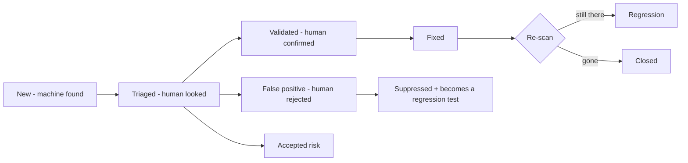

# Provex — Validation, Human-in-the-Loop & Reference Systems

*Automation finds things fast but is wrong sometimes — false positives (crying wolf) and false negatives (missing real issues). Because no one can stand behind a purely automated verdict, Provex is designed so a **human always checks before anything is "confirmed,"** and so we **cross-check our own accuracy against trusted, top-notch tools** instead of trying to out-scan them. This doc is that design plus the honest liability posture.*

---

## 1. Core principle: the machine proposes, a human confirms

Nothing Provex finds is ever presented as "true" on its own. Every finding moves through a lifecycle, and only a human can promote it to *validated*.

Rules:
- Reports **visually separate** machine-found (unvalidated) from human-validated findings. A client report never implies a machine guess is a confirmed vuln.
- Every finding carries a **confidence level** (high/medium/low). Low-confidence = "review me first," and can be filtered so noise is opt-in.
- **High/Critical findings require a second confirmation** ("four-eyes") before they enter a client report — even solo, that's a deliberate re-verify step, not a reflex.

---

## 2. What makes manual checking fast (evidence-first review)

Manual verification only works if the human can confirm in seconds. Each finding shows, inline:
- The **raw request/response** and the **exact tool output** that triggered it.
- The **rule/template/pattern** that matched (so you see *why* it fired).
- A **one-line reproduction command** (curl/httpie) to re-test by hand.
- For web: an **auto-captured screenshot**.

If a reviewer can't reproduce it from the evidence, it doesn't get validated. This single design choice is what stops false positives reaching a report.

---

## 3. Reducing false positives *before* a human is needed (corroboration)

Don't make a human check everything — make the machine more trustworthy first:
- **Two-source corroboration.** If two independent methods agree (e.g. a header-based CORS check *and* an active `OPTIONS` probe), confidence is high. If only one fires, mark it low-confidence for review. Agreement between independent signals is the cheapest FP reducer.
- **Active re-validation of passive hints.** Passive observations get a safe active confirmation step (still non-destructive) before being raised.
- **Dedup across tools** so the same issue found by three tools is one finding, not three.

---

## 4. Checking that *we're* doing it right — trusted tools as oracles

This is your "use the top-notch ones to make sure our system is correct." You don't compete with them; you use them as a **measuring stick** in CI and periodically:

- **OWASP Benchmark project** — a deliberately-vulnerable app with a *scorecard* purpose-built to measure a scanner's true-positive / false-positive rate. Run Provex against it and you get an objective accuracy number to track release over release. This is the single best "are we accurate?" oracle and it's free.
- **Differential testing vs mature scanners.** On the same lab targets, run **OWASP ZAP**, **Nuclei (official)**, **OpenVAS/Greenbone**, **Nikto**, and diff their results against Provex. Where Provex disagrees with the consensus, that's a candidate FP/FN to investigate. Wire this into the accuracy harness from the project playbook.
- **Vulnerable-by-design lab targets** (your positive cases): OWASP **Juice Shop** and **WebGoat** (web), **DVWA** and **bWAPP** (classic web), **VAmPI** / **crAPI** (APIs), plus your own "clean" baselines as negative cases.
- **Methodology oracles (the standard "right way")**: OWASP **WSTG** (web), **API Security Top 10**, **MASVS/MASTG** (mobile), **PTES**, **MITRE ATT&CK**, **NIST SP 800-115**. Provex's checks and its manual checklists map to these, which is what makes it "standardized" and quietly educational without being *marketed* as a toy.

---

## 5. The feedback loop (accuracy compounds over time)

Human decisions are never thrown away — they train the system:
- Mark something **false positive** → it's suppressed on re-scan **and** becomes a regression test so it can never silently return.
- Find something the scanner **missed** (false negative) → add a lab case + a check so it's covered forever.
- Suppression rules can be **shared across engagements** (with justification), so the whole project gets less noisy as it's used.

Over months this is what turns a noisy young scanner into a trusted one — no big QA team required, just a disciplined loop.

---

## 6. Manual methodology mode (where human judgment is mandatory)

Some things automation genuinely cannot judge — business logic, authorization context (is this IDOR *actually* exposing someone else's data?), complex auth flows. For these, Provex ships a **guided manual checklist** mapped to WSTG/API-Top-10/MASVS, that the tester ticks off, with notes and evidence captured *alongside* the automated findings. Benefits: the platform records the human work too, the report reflects real testing (not just a scan), and a learner following the checklist is walked through the standard method. This is your "little bit of everything," done tastefully.

---

## 7. Your forensics edge: evidence integrity (a real differentiator)

Your Digital Forensics background maps onto one feature the paid tools *brag* about (an auditor-followable replay trail) and most OSS tools lack — so lean in:
- **Hash + timestamp every artifact** (raw outputs, screenshots, logs) → a chain-of-custody-style evidence record per finding.
- **Append-only, tamper-evident audit log** of every action the platform took (who ran what, when, against what, with what result).
- **Reproducible evidence packages** exported with the report.

This is cheap to build, aligns with your degree, strengthens the liability posture below, and is a genuine selling point ("forensically sound evidence trail"). It's the one area where "a little bit of everything" is an asset, not scope creep.

---

## 8. Interoperate, don't reinvent (build vs integrate vs benchmark vs don't-build)

| Capability | Provex approach |
|---|---|
| Web / API / infra scanning | **Build the orchestration**, integrate engines (nuclei, nmap, ZAP, sqlmap, OpenVAS) |
| AD attack paths | **Integrate** BloodHound rather than build a graph engine |
| Secret detection | **Integrate** trufflehog / gitleaks |
| Mobile (static) | **Integrate** MobSF later; **don't build** dynamic mobile (NowSecure/Ostorlab territory) |
| Cloud posture | **Integrate** OSS ScoutSuite / Prowler later; don't hand-roll |
| Accuracy measurement | **Benchmark** against OWASP Benchmark + ZAP/Nuclei/OpenVAS diff |
| Vuln management / ticketing | **Interoperate** — export **SARIF** and support **DefectDojo** import so Provex plugs into existing pipelines instead of competing |
| Full detection/BAS, human PTaaS | **Don't build** — point users to the right category |

Supporting **SARIF** (the standard results format GitHub understands) and **DefectDojo** export early is high-leverage: it makes Provex a good citizen in a toolchain rather than a walled garden.

---

## 9. The honest liability posture ("we can't be held responsible")

Straight talk (and I'm not a lawyer — get one for the actual license and any commercial offering):

- **Apache-2.0 already disclaims warranty** — the software is provided "AS IS," no guarantee of fitness. That's your baseline shield and it's real, but it is **not absolute**: a disclaimer reduces liability, it doesn't erase it, especially if the tool causes actual damage or is marketed as a guarantee.
- **The real protection is the safety design, not the disclaimer**: non-destructive by default, approval-gated exploitation, scope enforcement, and never claiming completeness. A tool that can't break things and that requires human validation is a tool that's hard to blame for damage.
- **In-product honesty**: findings labeled with confidence and "machine-generated — requires human validation"; every report carries a **Methodology & Limitations** section stating that automated results must be human-verified and that no scanner finds everything.
- **`RESPONSIBLE_USE.md` + authorization gating** so the tool is only run on systems the user is allowed to test.
- **The forensic audit trail (§7)** is also liability protection: you can always show exactly what the tool did and did not do.

Net: you manage liability with **safe design + human-in-the-loop + honest labeling + a warranty disclaimer**, in that order of importance — not by hoping a line of legal text covers you.

---

*Summary: the machine proposes, a human confirms; we measure our own accuracy against the best free tools instead of racing them; we interoperate via SARIF/DefectDojo; and your forensics instinct for evidence integrity turns "we can't be held responsible" into "here's exactly, provably, what happened."*
